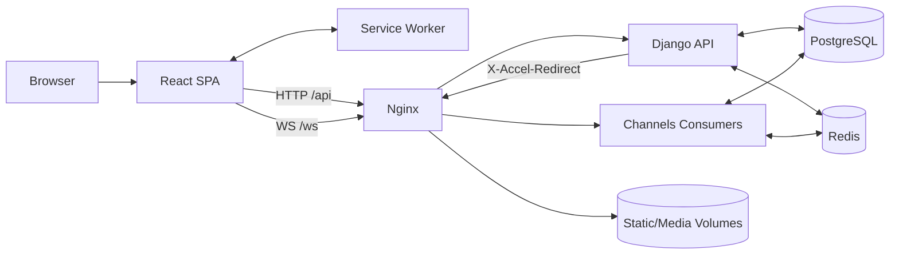
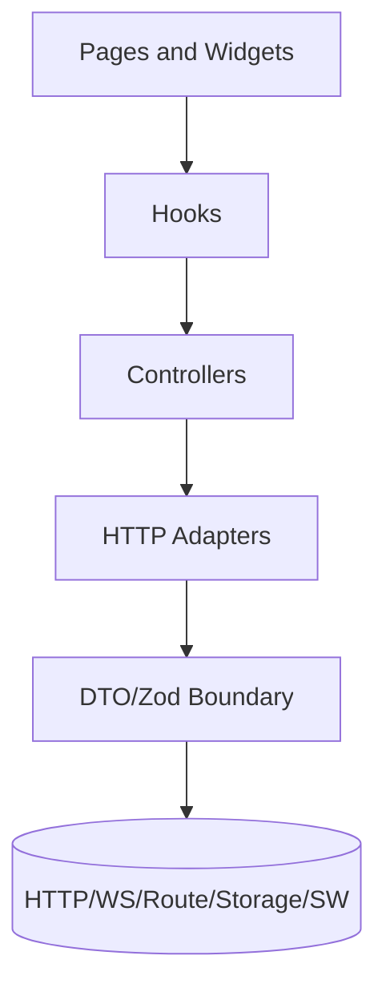
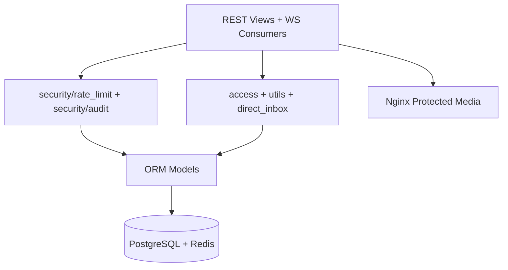
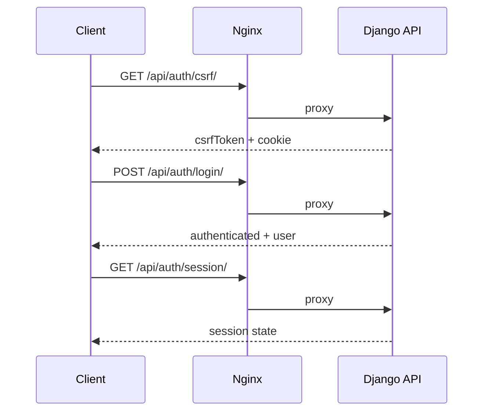
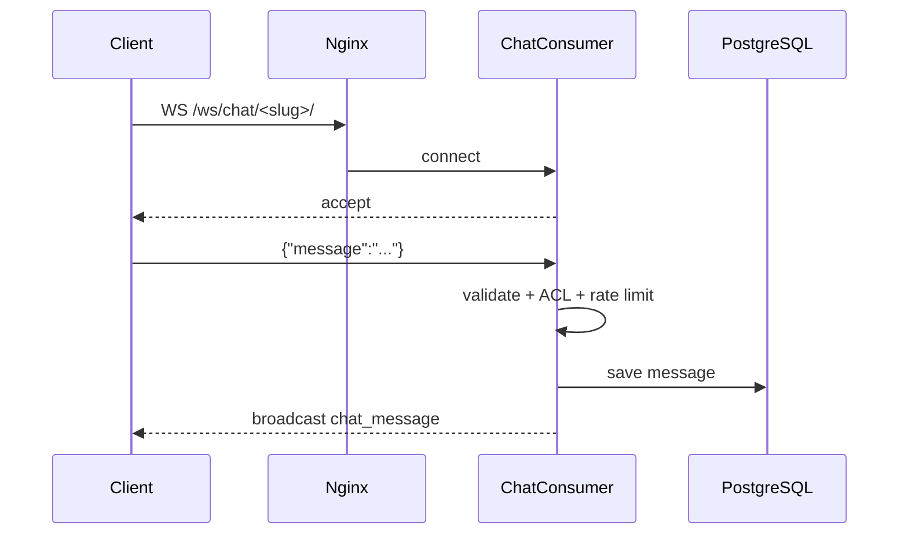
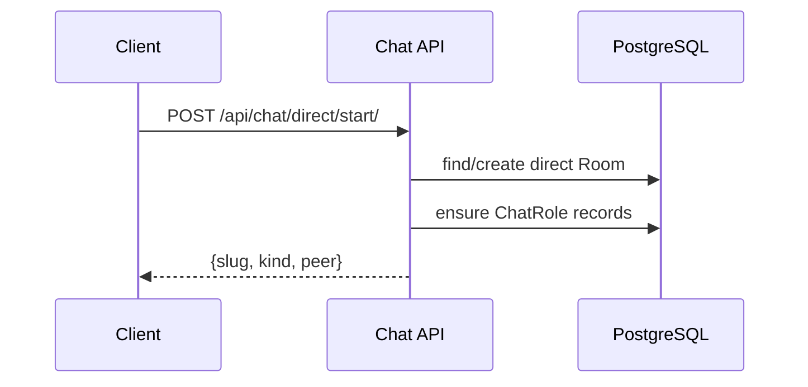
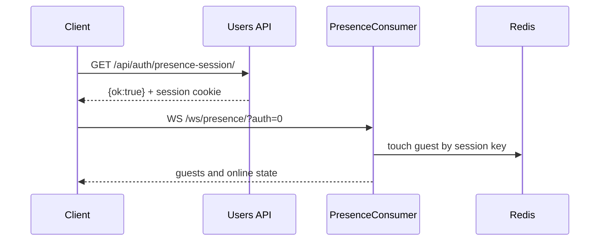
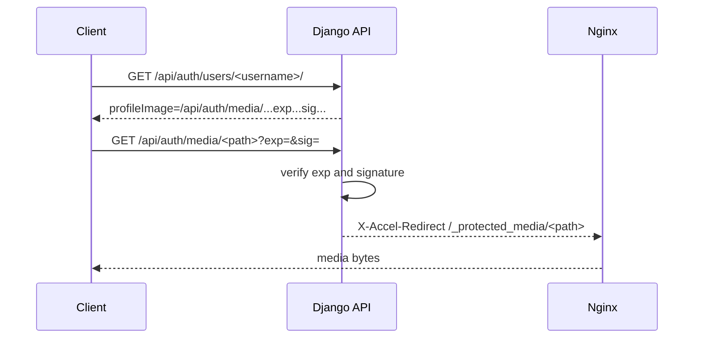

# EchoChat

EchoChat — это платформа для чата в реальном времени, созданная с помощью Django + Channels + React + TypeScript.
Этот файл README представляет собой единый источник инженерной информации для разработчиков, DevOps и технических специалистов.

## Содержание
- [1. Обзор проекта](#1-обзор-проекта)
- [2. Ключевые особенности](#2-ключевые-особенности)
- [3. Микроархитектура](#3-микроархитектура)
- [4. Потоки взаимодействия](#4-потоки-взаимодействия)
- [5. Структура репозитория](#5-структура-репозитория)
- [6. Frontend Details](#6-frontend-details)
- [7. Backend Details](#7-backend-details)
- [8. Модель данных](#8-модель-данных)
- [9. Справочник по REST API](#9-справочник-по-rest-api)
- [10. Протокол WebSocket](#10-протокол-websocket)
- [11. Конфигурация ENV](#11-конфигурация-env)
- [12. Local Development](#12-local-development)
- [13. Production Deployment](#13-production-deployment)
- [14. Тестирование и качество](#14-тестирование-и-качество)
- [15. Безопасность](#15-безопасность)
- [16. Наблюдаемость и диагностика](#16-наблюдаемость-и-диагностика)
- [17. Устранение неполадок](#17-устранение-неполадок)
- [18. Известные ограничения и план действий](#18-известные-ограничения-и-план-действий)

## 1. Обзор проекта
EchoChat поддерживает общедоступные чаты, частные комнаты, прямые диалоги, присутствие в реальном времени, профили пользователей, подписанный доступ к мультимедиа и кэширование на стороне браузера.

Основной технический стек:
- Backend: Django 4.1, Channels, PostgreSQL, Redis.
- Frontend: React 19, TypeScript, React Router, Zod.
- Инфраструктура: Docker Compose, Nginx с терминацией TLS.

## 2. Ключевые особенности
### Аутентификация и сессия
- `GET /api/auth/csrf/` для начальной загрузки CSRF.
- `GET /api/auth/session/` для текущего состояния аутентификации.
- `POST /api/auth/login/`, `POST /api/auth/register/`, `POST /api/auth/logout/`.
- `GET /api/auth/password-rules/`.

### Комнаты и обмен сообщениями
- Конечная точка публичной комнаты: `GET /api/chat/public-room/`.
- Информация о комнате: `GET /api/chat/rooms/<slug>/`.
- Сообщения комнаты с нумерацией страниц: `GET /api/chat/rooms/<slug>/messages/`.
- Обмен сообщениями в реальном времени через WebSocket `/ws/chat/<slug>/`.

### Прямые чаты
- Запустите прямой чат: `POST /api/chat/direct/start/`.
- Список прямых: `GET /api/chat/direct/chats/`.
- Direct Inbox WS: `/ws/direct/inbox/`.

### Присутствие
- Конечная точка гостевой начальной загрузки: `GET /api/auth/presence-session/`.
- Конечная точка присутствия WS: `/ws/presence/`.
- Идентификация гостя основана на сеансовом ключе.

### Профили и media
- Чтение/обновление текущего профиля: `GET/POST /api/auth/profile/`.
- Публичный профиль: `GET /api/auth/users/<username>/`.
- Подписанная media конечная точка: `GET /api/auth/media/<path>?exp=<unix>&sig=<hmac>`.

### Безопасность
- Постоянное ограничение скорости на базе БД.
- Ограничение частоты WebSocket‑подключений и отправки сообщений.
- Регистратор аудита безопасности `security.audit`.
- Защищенная доставка мультимедиа через X-Accel-Redirect.

## 3. Микроархитектура
### Схема системы


### Многоуровневый интерфейс


### Многоуровневое бэкэнд


## 4. Потоки взаимодействия
### Вход в систему и порядок сеанса


### Поток сообщений чата WS


### Порядок запуска прямого чата


### Поток присутствия гостя


### Подписанный медиапоток


## 5. Структура репозитория
```text
EchoRoom/
- backend/
  - chat/
  - users/
  - chat_app_django/
  - requirements*.txt
  - Dockerfile
  - manage.py
- frontend/
  - src/
    - app/
    - pages/
    - widgets/
    - shared/
    - adapters/
    - controllers/
    - dto/
    - entities/
    - sw.ts
  - e2e/
  - scripts/check-dto-boundary.mjs
- deploy/
  - nginx.conf
  - nginx.Dockerfile
- docker-compose.prod.yml
- example.env
- .github/workflows/test.yml
```

## 6. Frontend Details
### Маршрутизация
Определено в `frontend/src/app/routes.tsx`:
- `/`
- `/login`
- `/register`
- `/profile`
- `/users/:username`
- `/rooms/:slug`
- `/direct`
- `/direct/:username` (каноническое перенаправление на `/direct/@username`)

### Поставщики среды выполнения
Оболочка приложения (frontend/src/app/App.tsx) оборачивает маршруты с помощью:
- `RuntimeConfigProvider`
- `PresenceProvider`
- `DirectInboxProvider`

### Общий пользовательский интерфейс и модули CSS
- Общие UI-примитивы в `frontend/src/shared/ui/*`.
- Стили страниц и виджетов являются модулями CSS.
- Глобальный CSS содержит только base/reset и дизайн‑токены.

### Антикоррупционный уровень DTO
- Централизовано в `frontend/src/dto/*`.
- Использует Zod для декодирования всех внешних входов.
- Включает DTO для HTTP, WS, route params, storage и Service Worker сообщений.

### Service Worker
`frontend/src/sw.ts` настраивает стратегии Workbox:
- Активы/статические/скрипты/стили/шрифты: `CacheFirst`.
- Подписанный носитель `/api/auth/media/**`: `NetworkOnly`.
- Auth mutation endpoints: `NetworkOnly`.
- Сообщения: `NetworkFirst`.
- Комната/детали/профиль/прямые списки: `StaleWhileRevalidate`.

## 7. Backend Details
### Настройки и конфигурация
`backend/chat_app_django/settings.py` задает env-driven конфигурацию:
- security defaults для production;
- настройка DB/Redis/Channels;
- лимиты chat/presence/direct;
- параметры media signing.

### Состав URL-адреса
- Корневые URL-адреса: `backend/chat_app_django/urls.py`
- URL-адреса пользовательских API: `backend/users/urls.py`
- URL-адреса API чата: `backend/chat/api_urls.py`
- Маршрутизация WS: `backend/chat/routing.py`

### Конечная точка политики времени выполнения
- `GET /api/meta/client-config/`
- возвращает ограничения и политики времени выполнения интерфейса:
  - `usernameMaxLength`
  - `chatMessageMaxLength`
  - `chatRoomSlugRegex`
  - `mediaUrlTtlSeconds`
  - `mediaMode`

### Модель ролей доступа (ChatRole)
Источник: `backend/chat/models.py` и `backend/chat/access.py`.

| Роль | Чтение комнаты | Отправка сообщений |
|---|---|---|
| `owner` | Да | Да |
| `admin` | Да | Да |
| `member` | Да | Да |
| `viewer` | Да | Нет |
| `blocked` | Нет | Нет |

Правила применения:
- `public`: читать могут все, писать только авторизованные пользователи.
- `private`: доступ определяется ролью в `ChatRole`.
- `direct`: кроме роли, пользователь должен входить в пару `direct_pair_key`.

### Модули безопасности
- `security/rate_limit.py`: ограничитель на базе БД с fail-closed поведением.
- `security/audit.py`: события централизованного аудита безопасности.

### Выдача media
- Генерация и проверка подписанных URL: `backend/chat/utils.py`.
- Media endpoint: `backend/users/api.py`.
- Внутренний Nginx location `/_protected_media/` отдает байты файлов.

## 8. Модель данных
Основные субъекты:
- `Пользователь` (модель аутентификации Django)
- `Профиль` (аватар, биография, последнее посещение)
- `Комната` (`публичная`/`частная`/`прямая`)
- `ChatRole` (роль доступа к комнате)
- `Message` (сообщение в чате)
- `SecurityRateLimitBucket` (постоянное состояние ограничителя)

Ключевые ограничения:
- `Room.slug` уникален.
- `Room.direct_pair_key` уникален для пар прямого чата.
- `ChatRole(комната, пользователь)` уникальный.

## 9. Справочник по REST API
### Здоровье и мета
| Метод | Конечная точка | Авторизация | Цель |
|---|---|---|---|
| GET | `/api/health/live/` | Нет | Проверка жизнеспособности |
| GET | `/api/health/ready/` | Нет | Проверка готовности (db/cache) |
| GET | `/api/meta/client-config/` | Нет | Runtime‑конфигурация для frontend |

### Аутентификация и профиль
| Метод | Конечная точка | Авторизация | Цель |
|---|---|---|---|
| GET | `/api/auth/csrf/` | Нет | Получить CSRF токен |
| GET | `/api/auth/session/` | Нет | Состояние сессии |
| GET | `/api/auth/presence-session/` | Нет | Bootstrap guest session |
| POST | `/api/auth/login/` | Нет | Вход |
| POST | `/api/auth/register/` | Нет | Регистрация |
| POST | `/api/auth/logout/` | Да | Выход |
| GET | `/api/auth/password-rules/` | Нет | Политика паролей |
| GET | `/api/auth/profile/` | Да | Чтение своего профиля |
| POST | `/api/auth/profile/` | Да | Обновление своего профиля |
| GET | `/api/auth/users/<username>/` | Нет | Публичный профиль |
| GET | `/api/auth/media/<path>?exp=&sig=` | Подписано | Защищенный доступ к media |

### Чат и Директ
| Метод | Конечная точка | Авторизация | Цель |
|---|---|---|---|
| GET | `/api/chat/public-room/` | Нет | Метаданные публичной комнаты |
| GET | `/api/chat/rooms/<slug>/` | Условно | Метаданные комнаты с ACL |
| GET | `/api/chat/rooms/<slug>/messages/` | Условно | Сообщения комнаты с пагинацией |
| POST | `/api/chat/direct/start/` | Да | Создать/открыть direct комнату |
| GET | `/api/chat/direct/chats/` | Да | Список direct‑диалогов |

## 10. Протокол WebSocket
### Конечные точки
- `/ws/chat/<slug>/`
- `/ws/direct/inbox/`
- `/ws/presence/`

### События чата
Клиент -> сервер:
- `{ "message": "..." }`

Сервер -> клиент:
- `{ "сообщение", "имя пользователя", "profile_pic", "комната" }`
- `{ "ошибка": "message_too_long" }`
- `{ "ошибка": "запрещено" }`
- `{ "ошибка": "rate_limited" }`

### События Direct Inbox
Клиент -> сервер:
- `пинг`
- `set_active_room`
- `mark_read`

Сервер -> клиент:
- `direct_unread_state`
- `direct_inbox_item`
- `direct_mark_read_ack`
- `ошибка`
- `пинг` (сердцебиение)

### События присутствия
Клиент -> сервер:
- `пинг` (прикосновение)

Сервер -> клиент:
- обновления `онлайн + гости` (авторизация пользователей)
- количество `гостей` (гостей)
- `пинг` (сердцебиение)

### Важные коды закрытия
- `4401` несанкционированный
- `4403` запрещено
- `4404` не найден / неверный пул
- `4429` слишком много запросов
- Тайм-аут простоя присутствия `4000`
- `4001` тайм-аут простоя чата
- `4002` тайм-аут простоя прямого почтового ящика

## 11. Конфигурация ENV
Источник истины: example.env и backend/chat_app_django/settings.py.

Основные группы:
- секреты и флаги отладки
- хосты/CORS/CSRF/HTTPS
- база данных и Redis
- ограничения авторизации/чата/присутствия/прямых
- Медиа-подпись и ограничения на загрузку

Важные настройки по умолчанию в производстве:
- `DJANGO_DEBUG=0`
- `DJANGO_RELAX_PASSWORDS=0`
- включены secure cookie для HTTPS.
- media работает в режиме signed_only.
- если Cloudflare не используется, оставляйте `DJANGO_TRUSTED_PROXY_RANGES` только для ваших реальных прокси/внутренних сетей.

## 12. Local Development
### Серверная часть (PowerShell)
```powershell
cd backend
python -m venv .venv
.\.venv\Scripts\Activate.ps1
python -m pip install --upgrade pip
pip install -r requirements-dev.txt
python manage.py migrate
python manage.py runserver
```

### Бэкенд (Bash)
```bash
cd backend
python3 -m venv .venv
source .venv/bin/activate
python -m pip install --upgrade pip
pip install -r requirements-dev.txt
python manage.py migrate
python manage.py runserver
```

### Интерфейс (PowerShell)
```powershell
cd frontend
npm ci
npm run dev
```

### Фронтенд (Bash)
```bash
cd frontend
npm ci
npm run dev
```

## 13. Production Deployment
### Docker Compose
```bash
docker compose -f docker-compose.prod.yml up --build
```

### Nginx
- `/api/` и `/ws/` проксируются в backend.
- `/static/` обслуживается из статического тома.
- `/media/` заблокирован в производстве.
- `/_protected_media/` является только внутренним.

### TLS
Nginx ожидает сертификаты в:
- `deploy/certs/fullchain.pem`
- `deploy/certs/privkey.pem`

## 14. Тестирование и качество
### Пакет качества внешнего интерфейса
```powershell
cd frontend
npm ci
npm run lint
npm run check:dto-boundary
npm run test:coverage
npm run build
```

### Пакет качества серверной части
```powershell
cd backend
.\.venv\Scripts\Activate.ps1
coverage run --rcfile=.coveragerc manage.py test
coverage report --rcfile=.coveragerc --fail-under=90
```

### E2E
```powershell
cd frontend
npm run test:e2e
```

Файл CI: `.github/workflows/test.yml`.
Вакансии:
- backend-тесты
- фронтенд-блок
- e2e (зависит от предыдущих мест работы)

## 15. Безопасность
Реализованные элементы управления:
- постоянные сегменты ограничения скорости в БД;
- Регулирование подключения WebSocket;
- ограничение скорости сообщений в чате;
- подписанный URL-адрес носителя со сроком действия и HMAC;
- безопасные файлы cookie и перенаправление SSL в производстве;
- централизованный журнал аудита событий безопасности.

## 16. Наблюдаемость и диагностика
- Конечные точки здоровья:
  - `/api/health/live/`
  - `/api/health/ready/`
- Структурированные логи через конфигурацию Django logging.
- События безопасности через logger `security.audit`.

## 17. Устранение неполадок
### Браузер запрашивает `/media/...` и получает 404
Это ожидается в режиме только для подписи.
Используйте URL-адреса мультимедиа из полезных данных API (`/api/auth/media/...`).

### WebSocket закрывается с `4429`
Сработало ограничение скорости.
Проверьте `WS_CONNECT_RATE_LIMIT` и `WS_CONNECT_RATE_WINDOW`.

### CSRF-ошибки
Проверьте:
- Токен CSRF в заголовках запросов;
- доверенные источники и настройки CORS;
- безопасное поведение файлов cookie для текущего протокола.

## 18. Известные ограничения и план действий
Планируемые улучшения:
- дальнейшая декомпозиция крупных модулей;
- расширен охват аудита безопасности;
- более богатые сценарии регрессии e2e;
- дополнительные метрики наблюдаемости.
